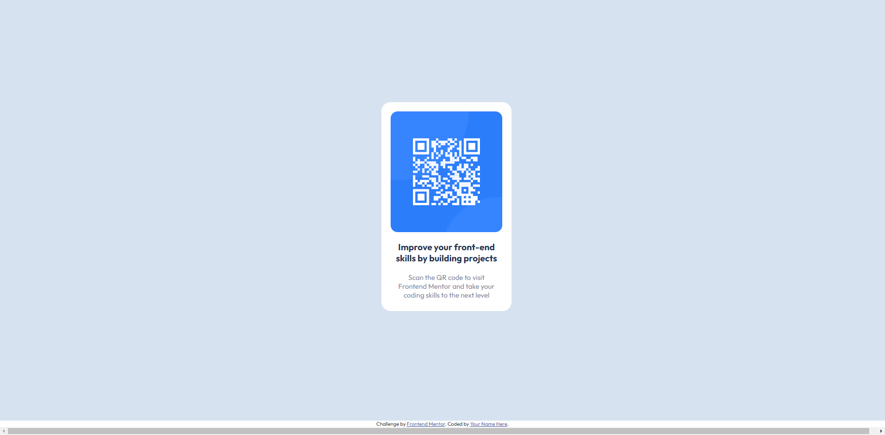
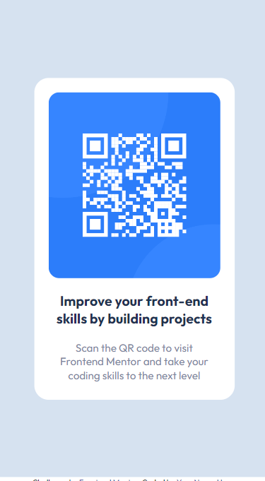

# Frontend Mentor - QR code component solution

This is a solution to the [QR code component challenge on Frontend Mentor](https://www.frontendmentor.io/challenges/qr-code-component-iux_sIO_H). Frontend Mentor challenges help you improve your coding skills by building realistic projects. 

## Table of contents

- [Overview](#overview)
  - [Screenshot](#screenshot)
  - [Links](#links)
- [My process](#my-process)
  - [Built with](#built-with)
  - [What I learned](#what-i-learned)
  - [Continued development](#continued-development)

- [Author](#author)


**Note: Delete this note and update the table of contents based on what sections you keep.**

## Overview

### Screenshot
- Desktop version

- Mobile version 
- 


### Links

- Solution URL: [GitHub](https://github.com/EshrakRahman/QR-code-component-challenge)
- Live Site URL: [GitHub Page](https://eshrakrahman.github.io/QR-code-component-challenge/)

## My process

### Built with

- Semantic HTML5 markup
- CSS custom properties
- Flexbox
- Desktop-first workflow


### What I learned

I recently completed a newbie challenge on FrontendMasters, diving deep into the world of CSS Flexbox. Before this, positioning items in dynamic layouts felt complex. Flexbox, however, transformed my approach, offering a streamlined method to align and distribute elements within a container. Through properties like justify-content, align-items, and flex-direction, I mastered the art of creating responsive and visually appealing designs. This wasn't just about grasping a theoretical concept; it was hands-on learning, giving me the confidence to tackle modern web design challenges with a fresh perspective.

To see how you can add code snippets, see below:

```html
<div class="box-details">
  
  <p class="title">
    Improve your front-end skills by building projects
  </p>
  <p class="pera">
    Scan the QR code to visit Frontend Mentor and take your coding skills to the next level
  </p>
</div>
```
```css
.box-details img {
  width: 240px;
  height: 260px;
  object-fit: cover;
  border-radius: 15px;
}
.box-details .title {
  margin: 20px 0;
  font-size: 1.2rem;
  font-weight: bold;
  width: 80%;
  color: hsl(218, 44%, 22%);
  text-align: center;
}

```


### Continued development

Having tackled FrontendMasters' challenge, I delved into CSS Flexbox, streamlining complex layouts with newfound mastery. Using pivotal properties, I now confidently craft responsive designs, a testament to my hands-on growth in modern web design. My continuous development highlights my resilience and adaptabilit


## Author

- Website - [Eshrak Rahman](https://www.github.com/eshrakrahman)
- Frontend Mentor - [@eshrakrahman](https://www.frontendmentor.io/profile/eshrakrahman)


